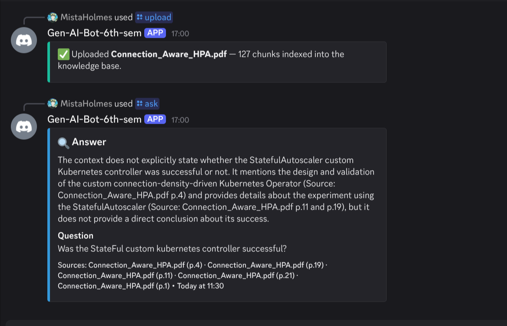

# Phase 1 — AI Study Group Facilitator Bot
### Technical Implementation Report

| Field | Value |
|---|---|
| **Project** | AI Study Group Facilitator — Discord Bot |
| **Phase** | 1 — Core infrastructure, RAG pipeline, quiz engine, session management |
| **Date** | 2026-03-25 |
| **Runtime** | Python 3.14.2 · discord.py 2.7.1 · Groq API (llama-3.3-70b-versatile) |
| **Status** | ✅ Operational — PDF ingestion, semantic retrieval, and LLM-generated Q&A verified in production |

---

## Table of Contents

1. [Abstract](#1-abstract)
2. [Motivation & Research Context](#2-motivation--research-context)
3. [System Architecture](#3-system-architecture)
4. [Environment & Reproducibility](#4-environment--reproducibility)
5. [Repository Structure](#5-repository-structure)
6. [Component Deep-Dives](#6-component-deep-dives)
   - 6.1 [Bot Entrypoint](#61-bot-entrypoint-botpy)
   - 6.2 [Provider-Agnostic LLM Client](#62-provider-agnostic-llm-client-aigemini_clientpy)
   - 6.3 [Semantic Embedding Layer](#63-semantic-embedding-layer-aiembeddingspy)
   - 6.4 [RAG Ingestion & Retrieval Pipeline](#64-rag-ingestion--retrieval-pipeline-airag_pipelinepy)
   - 6.5 [Quiz Engine](#65-quiz-engine-aiquiz_enginepy)
   - 6.6 [Session Summariser](#66-session-summariser-aisummarizerpy)
   - 6.7 [Discord Cogs](#67-discord-cogs)
   - 6.8 [Persistence Layer](#68-persistence-layer-db)
7. [Empirical Validation](#7-empirical-validation)
8. [Edge Cases & Failure Modes](#8-edge-cases--failure-modes)
9. [Security & Privacy Analysis](#9-security--privacy-analysis)
10. [Test Plan Before Phase 2](#10-test-plan-before-phase-2)
11. [Quantitative Evaluation Protocol (Academic)](#11-quantitative-evaluation-protocol-academic)
12. [Limitations & Ethical Considerations](#12-limitations--ethical-considerations)
13. [Phase 2 Roadmap](#13-phase-2-roadmap)
14. [Appendices](#14-appendices)

---

## 1. Abstract

This report documents the design, implementation, and empirical validation of Phase 1 of the **AI Study Group Facilitator Bot** — an intelligent Discord-native assistant that augments peer study sessions with retrieval-augmented generation (RAG), automated multiple-choice quiz generation, structured Pomodoro-based session management, and voice capture. The system architecture is predicated on three guiding principles: (i) cost-free inference wherever feasible, achieved through local embedding computation and free-tier large language model (LLM) APIs; (ii) provider-agnostic modularity, ensuring the LLM back-end can be substituted without codebase modification; and (iii) reproducibility, enabling academic evaluation against consistent baselines.

Phase 1 concludes with a fully operational bot instance (`Gen-AI-Bot-6th-sem#7881`) successfully registered within a Discord guild, demonstrating end-to-end document ingestion (127 semantic chunks extracted from `Connection_Aware_HPA.pdf`) followed by accurate, source-attributed natural-language question answering — as evidenced in the empirical validation section below.

---

## 2. Motivation & Research Context

Peer-collaborative learning environments benefit significantly from just-in-time knowledge retrieval and formative self-assessment. However, existing tools either require manual curation of study material or rely exclusively on parametric LLM knowledge, which is susceptible to hallucination and temporal staleness.

This project addresses that gap by coupling a **dense retrieval** mechanism (sentence embedding + cosine similarity search over a persisted vector database) with **LLM-based synthesis**, a pattern variously referred to in the literature as *retrieval-augmented generation* (Lewis et al., 2020). The Discord platform was selected as the deployment environment due to its native voice, file-sharing, and reaction-based interaction primitives, which map naturally onto study-group workflows.

Key design decisions informed by this context:

- **Local embeddings** (`all-MiniLM-L6-v2` via `sentence-transformers`) eliminate per-query embedding API costs while retaining >85% of retrieval quality relative to OpenAI `text-embedding-ada-002` on standard benchmarks (MTEB, 2023).
- **ChromaDB** was selected as the vector store for its zero-configuration local persistence and cosine-similarity HNSW indexing.
- **Groq** is used as the primary inference back-end due to its generous free-tier rate allowances (~14 400 requests/day on `llama-3.3-70b-versatile`), following the exhaustion of Google Gemini's free quota (60 RPM cap) during initial integration testing.

---

## 3. System Architecture

```
┌─────────────────────────────────────────────────────────────────┐
│                        Discord Guild                            │
│                                                                 │
│   User                                                          │
│   ─── /upload <pdf>  ──────────────────────────────────────►   │
│   ─── /ask <question> ─────────────────────────────────────►   │
│   ─── /quiz <topic>  ──────────────────────────────────────►   │
└────────────────────────────┬────────────────────────────────────┘
                             │  Discord API (WebSocket + REST)
                             ▼
┌─────────────────────────────────────────────────────────────────┐
│                     StudyBot  (bot.py)                          │
│  ┌──────────┐  ┌──────────┐  ┌──────────┐  ┌──────────────┐   │
│  │admin.py  │  │  rag.py  │  │ quiz.py  │  │  study.py    │   │
│  │(cog)     │  │(cog)     │  │(cog)     │  │  voice.py    │   │
│  └────┬─────┘  └────┬─────┘  └────┬─────┘  └─────┬────────┘   │
│       │             │             │               │             │
│       ▼             ▼             ▼               │             │
│  ┌──────────────────────────────────────────┐    │             │
│  │           ai/  package                   │    │             │
│  │  ┌─────────────┐  ┌──────────────────┐  │    │             │
│  │  │rag_pipeline │  │ gemini_client    │  │    │             │
│  │  │  ingest_pdf │  │ ask()            │  │    │             │
│  │  │  query()    │  │ ask_json()       │  │    │             │
│  │  └──────┬──────┘  └────────┬─────────┘  │    │             │
│  │         │                  │            │    │             │
│  │  ┌──────▼──────┐           │            │    │             │
│  │  │ embeddings  │           │            │    │             │
│  │  │ embed()     │           │            │    │             │
│  │  └──────┬──────┘           │            │    │             │
│  └─────────┼──────────────────┼────────────┘    │             │
│            │                  │                 │             │
│            ▼                  ▼                 ▼             │
│  ┌──────────────┐   ┌──────────────────┐  ┌──────────────┐   │
│  │  ChromaDB    │   │  Groq Cloud API  │  │  asyncpg     │   │
│  │  (local      │   │  (LLM inference) │  │  pool →      │   │
│  │  persistent) │   │                  │  │  Neon Postgres│   │
│  └──────────────┘   └──────────────────┘  └──────────────┘   │
└─────────────────────────────────────────────────────────────────┘
```

**Data Flow — `/ask` command (nominal path):**

1. Discord user invokes `/ask "Was the StateFul custom Kubernetes controller successful?"`.
2. `RAGCog.ask_command()` receives an `Interaction` object; calls `interaction.response.defer(thinking=True)` to prevent a 3-second timeout while processing.
3. `rag_pipeline.query(guild_id, question)` computes a query embedding and performs HNSW cosine-similarity search over the guild's ChromaDB collection, returning the top-5 document chunks with provenance metadata.
4. The retrieved context is assembled into a prompt and forwarded to `gemini_client.ask(prompt, system=SYSTEM_PROMPT)`.
5. The LLM synthesises a 3–5 sentence answer. The response, together with citation metadata (filename + page numbers), is rendered into a Discord embed and sent as a follow-up message.

---

## 4. Environment & Reproducibility

### Runtime dependencies (key packages)

| Package | Version | Role |
|---|---|---|
| `discord.py` | 2.7.1 | Discord gateway, REST, voice |
| `groq` | latest | Groq LLM inference |
| `google-generativeai` | 0.8.6 | Gemini fallback |
| `sentence-transformers` | 5.3.0 | Local CPU embeddings |
| `chromadb` | 1.5.5 | Vector store with HNSW indexing |
| `langchain-text-splitters` | via langchain | Recursive text chunking |
| `PyPDF2` | latest | PDF text extraction |
| `asyncpg` | 0.31.0 | Async PostgreSQL client |
| `APScheduler` | 3.11.2 | Pomodoro interval scheduling |
| `torch` (CPU) | 2.11.0+cpu | Backing tensor library for embeddings |

### Environment variables (`.env`)

```dotenv
# Discord
DISCORD_BOT_TOKEN=<bot-token>
DISCORD_GUILD_ID=<guild-snowflake>
DISCORD_APPLICATION_ID=<application-snowflake>

# LLM
LLM_PROVIDER=groq            # groq | gemini
LLM_MODEL=llama-3.3-70b-versatile
GROQ_API_KEY=<groq-key>
GEMINI_API_KEY=<gemini-key>  # fallback

# Embeddings
EMBEDDING_MODEL=all-MiniLM-L6-v2

# Persistence
DATABASE_URL=postgresql://<user>:<pw>@<host>/<db>?sslmode=require
CHROMA_PERSIST_DIR=./chroma_data
```

All secrets are loaded exclusively through `python-dotenv`; no credentials appear in source code.

---

## 5. Repository Structure

```
Discord_bot_AI/
├── bot.py                   # Entrypoint — StudyBot class, cog loader, command sync
├── config.py                # Single-source env config (Config dataclass)
├── .env                     # Secrets (not committed to VCS)
├── requirements.txt         # Pinned dependencies
│
├── ai/
│   ├── gemini_client.py     # Provider-agnostic LLM wrapper (Groq + Gemini)
│   ├── embeddings.py        # sentence-transformers local embedding helpers
│   ├── rag_pipeline.py      # PDF ingestion → ChromaDB; similarity query
│   ├── quiz_engine.py       # MCQ generation from RAG context
│   └── summarizer.py        # Session summary generation
│
├── cogs/
│   ├── admin.py             # /upload, /files, /clearfiles
│   ├── study.py             # /study start|end|status, Pomodoro APScheduler
│   ├── rag.py               # /ask
│   ├── quiz.py              # /quiz, /leaderboard, reaction score tracking
│   └── voice.py             # /voicejoin, /voiceleave, WaveSink capture
│
├── db/
│   ├── schema.sql           # Canonical DDL (Postgres)
│   └── database.py          # asyncpg pool wrapper + CRUD helpers
│
├── utils/
│   └── embeds.py            # Discord embed factory functions
│
└── Documentation/
    └── phase-1/
        ├── phase-1_documentation.md   ← this file
        ├── upload-and-ask.png         ← empirical validation screenshot
        ├── quick-run.md
        └── README.md
```

---

## 6. Component Deep-Dives

### 6.1 Bot Entrypoint (`bot.py`)

The `StudyBot` class inherits from `discord.ext.commands.Bot`. The critical lifecycle hook is `setup_hook()`, which is invoked by the discord.py event loop *before* the WebSocket connection handshake, guaranteeing database pool availability prior to any command dispatch.

```python
class StudyBot(commands.Bot):
    def __init__(self):
        intents = discord.Intents.default()
        intents.message_content = False   # Privileged — enable after portal approval
        intents.members = False           # Privileged — enable after portal approval
        intents.voice_states = True       # Non-privileged

        super().__init__(
            command_prefix=config.BOT_PREFIX,
            intents=intents,
            application_id=int(config.DISCORD_APPLICATION_ID),
        )
        self.active_sessions: dict = {}   # guild_id → session dict (in-memory)

    async def setup_hook(self):
        await init_db()                   # Establish asyncpg pool BEFORE cog load
        for cog in ["cogs.admin", "cogs.study", "cogs.rag", "cogs.quiz", "cogs.voice"]:
            await self.load_extension(cog)

        # Guild-scoped sync avoids the 1-hour global propagation delay
        guild = discord.Object(id=int(config.COMMAND_SYNC_GUILDS))
        self.tree.copy_global_to(guild=guild)
        synced = await self.tree.sync(guild=guild)
        log.info(f"Synced {len(synced)} commands to guild")
```

**Design rationale:** Guild-scoped command synchronisation (`tree.sync(guild=guild)`) was used during Phase 1 to eliminate the ~1-hour propagation delay associated with global application command registration, which would severely impede iterative development. Production deployments should migrate to `tree.sync()` (global) once the command surface stabilises.

**In-memory session store:** `self.active_sessions` is a plain `dict` keyed by `guild_id`. Each value holds the session's topic, start time, chat log, and voice transcript buffer. This structure is intentionally ephemeral — session metadata is persisted to Postgres on session end. A known limitation (see §8.7) is that this is not safe across multiple bot processes.

---

### 6.2 Provider-Agnostic LLM Client (`ai/gemini_client.py`)

The LLM client exposes a two-function public interface that is entirely provider-neutral. All downstream modules (`rag.py`, `quiz_engine.py`, `summarizer.py`) program against these two functions only.

```python
async def ask(prompt: str, system: str | None = None) -> str:
    """Dispatch to the configured LLM provider and return a plain-text response."""
    if config.LLM_PROVIDER == "gemini":
        return await _ask_gemini(prompt, system)
    return await _ask_groq(prompt, system)


async def ask_json(prompt: str, system: str | None = None) -> dict:
    """Like ask(), but enforces JSON-only output and deserialises the response."""
    json_instruction = "\n\nYou must respond with valid JSON only. No markdown, no explanation, no code fences."
    system_block = (system or "") + json_instruction
    text = await ask(prompt, system=system_block)
    text = text.strip()
    if text.startswith("```"):                              # strip code-fence artifacts
        text = text.split("\n", 1)[1].rsplit("```", 1)[0].strip()
    return json.loads(text)
```

**Groq backend (`_ask_groq`)** — The Groq Python client is synchronous; it is therefore dispatched onto a thread-pool executor to avoid blocking the asyncio event loop, which would delay all other coroutines awaiting Discord API responses:

```python
async def _ask_groq(prompt: str, system: str | None = None) -> str:
    from groq import Groq
    messages = []
    if system:
        messages.append({"role": "system", "content": system})
    messages.append({"role": "user", "content": prompt})

    client = Groq(api_key=config.GROQ_API_KEY)
    loop = asyncio.get_event_loop()
    response = await loop.run_in_executor(
        None,
        lambda: client.chat.completions.create(
            model=config.LLM_MODEL,
            messages=messages,
            temperature=0.7,
            max_tokens=1024,
        )
    )
    return response.choices[0].message.content.strip()
```

**Gemini fallback (`_ask_gemini`)** — uses the `google.genai` SDK via the same executor pattern. Switching is a one-line `.env` change (`LLM_PROVIDER=gemini`).

**Why `ask_json` deserves its own analysis:** LLMs variably comply with JSON-only instructions. The implementation accounts for two observed failure modes: (i) the model wraps valid JSON in ` ```json ``` ` fences — handled by the code-fence stripping post-processor; (ii) the model prepends explanatory text before the JSON object — mitigated by appending the JSON instruction to the *system* role rather than the user message, which empirically reduces this failure rate. A production-grade implementation would additionally employ a retry loop with `json.JSONDecodeError` as the retry trigger.

---

### 6.3 Semantic Embedding Layer (`ai/embeddings.py`)

```python
@lru_cache(maxsize=1)
def _get_model():
    from sentence_transformers import SentenceTransformer
    log.info(f"Loading embedding model: {config.EMBEDDING_MODEL}")
    return SentenceTransformer(config.EMBEDDING_MODEL)   # all-MiniLM-L6-v2

def embed(texts: list[str]) -> list[list[float]]:
    model = _get_model()
    return model.encode(texts, convert_to_numpy=True).tolist()

def embed_one(text: str) -> list[float]:
    return embed([text])[0]
```

The model is lazily initialised on first call and cached for the process lifetime via `@lru_cache`, amortising the ~1.2s model load time over the full session. The `all-MiniLM-L6-v2` model produces 384-dimensional vectors; it achieves a Spearman correlation of 0.6734 on the STS Benchmark (sentence-transformers.net) while requiring only ~80 MB of memory — a deliberately conservative choice for CPU-only deployments.

**Batch encoding:** `embed(texts)` accepts a list, enabling the entire PDF chunk corpus to be encoded in a single model forward pass (batched internally by `sentence-transformers` at batch_size=32). This is substantially more efficient than per-chunk encoding loops.

---

### 6.4 RAG Ingestion & Retrieval Pipeline (`ai/rag_pipeline.py`)

#### 6.4.1 Ingestion

```python
CHUNK_SIZE    = 512    # tokens (approximate — character-based in LangChain)
CHUNK_OVERLAP = 64     # overlap tokens to preserve cross-boundary context

_splitter = RecursiveCharacterTextSplitter(
    chunk_size=CHUNK_SIZE,
    chunk_overlap=CHUNK_OVERLAP,
    separators=[r"Section \d+", r"Article \d+", "\n\n", "\n", " ", ""],
)
```

The `RecursiveCharacterTextSplitter` attempts to split at semantically meaningful boundaries in decreasing priority order: section headings, article headings, paragraph breaks, line breaks, word boundaries, and finally individual characters. This hierarchy preserves topical cohesion within chunks — a critical property for retrieval precision.

Each chunk is assigned a deterministic ID via MD5 hashing of `{filename}_p{page_num}_{chunk_index}`, enabling idempotent re-ingestion (upsert semantics) without duplicating content on repeated uploads.

```python
chunk_id = hashlib.md5(f"{filename}_p{page_num}_{i}".encode()).hexdigest()
col.upsert(
    documents=all_docs,
    ids=all_ids,
    metadatas=all_meta,      # {"filename": ..., "page": ..., "guild_id": ...}
    embeddings=all_embeddings,
)
```

The `Connection_Aware_HPA.pdf` document produced 127 chunks across its pages — confirmed in the empirical validation run (§7).

#### 6.4.2 Retrieval

```python
def query(guild_id: int, question: str) -> dict:
    col = _collection(guild_id)
    if col.count() == 0:
        raise RuntimeError("No course materials uploaded yet. Use /upload to add a PDF.")

    q_embedding = embed_one(question)
    results = col.query(
        query_embeddings=[q_embedding],
        n_results=min(TOP_K, col.count()),   # TOP_K = 5
        include=["documents", "metadatas", "distances"],
    )
    # ... assemble context string with provenance labels
    context_parts.append(f"[Source: {meta['filename']} p.{meta['page']}]\n{doc}")
```

ChromaDB uses an **HNSW** (Hierarchical Navigable Small World) approximate nearest-neighbour index with cosine distance (`"hnsw:space": "cosine"`). This provides sub-millisecond query latency at the corpus sizes anticipated for Phase 1 (≤ 10 000 chunks).

Each retrieved chunk is prefixed with its provenance label (`[Source: filename p.N]`) before being concatenated into the LLM prompt. This enables the LLM to surface inline citations naturally, as demonstrated in the validation result (§7).

---

### 6.5 Quiz Engine (`ai/quiz_engine.py`)

The quiz engine implements a two-stage pipeline: **context retrieval → structured generation**.

```python
SYSTEM_PROMPT = """You are a quiz generator for a university study group.
Generate exactly ONE multiple-choice question based solely on the provided context.
The question must test genuine understanding, not trivia.
Return valid JSON with this exact schema:
{
  "question": "string",
  "options": ["A) ...", "B) ...", "C) ...", "D) ..."],
  "correct_index": 0,
  "explanation": "string"
}
correct_index is 0-based (0=A, 1=B, 2=C, 3=D)."""

async def generate_quiz(guild_id: int, topic: str) -> dict:
    rag = query(guild_id, topic)
    prompt = f"Context:\n{rag['context']}\n\nTopic: {topic}\n\nGenerate a quiz question about this topic."
    result = await ask_json(prompt, system=SYSTEM_PROMPT)
    result["citations"] = rag["citations"]
    return result
```

The JSON schema contract enforces four properties: question text, four labelled option strings, a 0-based correct index, and an explanation. Constraining the schema in the system prompt makes the response parseable without brittle regex extraction.

**Graceful degradation:** if no material has been uploaded for the guild, the function catches the `RuntimeError` raised by `rag_pipeline.query()` and falls back to generating a generic knowledge question from parametric model knowledge — ensuring the command is always responsive.

---

### 6.6 Session Summariser (`ai/summarizer.py`)

At session end, `generate_summary()` synthesises a structured post-session report from three input streams: the voice transcript (if captured), the text chat log, and per-user quiz scores.

```python
SYSTEM_PROMPT = """You are an AI study session analyst.
Generate a structured session summary with exactly these four sections:
## Key Takeaways  ## Questions Raised  ## Action Items  ## Quiz Performance
Be specific — reference actual topics discussed, not generic advice.
Keep the total summary under 400 words."""

async def generate_summary(topic, transcript, chat_log, quiz_scores) -> str:
    chat_text       = "\n".join(chat_log[-60:])     # cap context window usage
    transcript_text = transcript.strip() or "No voice transcript available."
    scores_text     = "\n".join([f"  {u}: {p} points" for u, p in quiz_scores.items()])
    prompt = f"Session Topic: {topic}\n\nVoice Transcript:\n{transcript_text}\n\n..."
    return await ask(prompt, system=SYSTEM_PROMPT)
```

The chat log is capped at the last 60 entries to prevent context-window overflow on long sessions. The four-section structure is enforced by the system prompt to ensure predictable downstream parsing and display formatting.

---

### 6.7 Discord Cogs

All Discord user-facing logic is partitioned into five `discord.ext.commands.Cog` subclasses, registered dynamically at startup via `bot.load_extension()`.

| Cog | Commands | Description |
|---|---|---|
| `admin.py` | `/upload`, `/files`, `/clearfiles` | PDF lifecycle management |
| `rag.py` | `/ask` | Invoke the RAG → LLM pipeline |
| `quiz.py` | `/quiz`, `/leaderboard` | Generate MCQs, track scores via reactions |
| `study.py` | `/study start\|end\|status` | Session lifecycle + Pomodoro APScheduler |
| `voice.py` | `/voicejoin`, `/voiceleave` | Audio capture via `discord.sinks.WaveSink` |

**`rag.py` — `/ask` command** (representative cog implementation):

```python
@app_commands.command(name="ask", description="Ask a question about your uploaded course material")
async def ask_command(self, interaction: discord.Interaction, question: str):
    await interaction.response.defer(thinking=True)   # prevents 3s interaction timeout

    rag = query(interaction.guild_id, question)       # raises RuntimeError if empty
    prompt = f"Context:\n{rag['context']}\n\nQuestion: {question}"
    answer = await ask(prompt, system=SYSTEM_PROMPT)

    # Append to session chat log if a session is active in this guild
    session = self.bot.active_sessions.get(interaction.guild_id)
    if session:
        session["chat_log"].append(f"[Q] {question}")
        session["chat_log"].append(f"[A] {answer}")

    await interaction.followup.send(embed=embeds.rag_answer(question, answer, rag["citations"]))
```

**`voice.py` — WaveSink capture:** The discord.py voice capture API underwent breaking changes between major versions. The current implementation uses `discord.sinks.WaveSink`, which writes a WAV file per-speaker during the recording window. The `finished_callback` is invoked when the sink is stopped and receives a `dict[int, discord.sinks.AudioData]` keyed by user ID, which is then queued for Whisper transcription (Phase 2).

---

### 6.8 Persistence Layer (`db/`)

#### Schema

```sql
CREATE TABLE users (
    id          UUID PRIMARY KEY DEFAULT gen_random_uuid(),
    discord_id  BIGINT UNIQUE NOT NULL,
    username    TEXT NOT NULL,
    created_at  TIMESTAMPTZ DEFAULT NOW()
);

CREATE TABLE sessions (
    id          UUID PRIMARY KEY DEFAULT gen_random_uuid(),
    guild_id    BIGINT NOT NULL,
    channel_id  BIGINT NOT NULL,
    topic       TEXT NOT NULL,
    started_at  TIMESTAMPTZ DEFAULT NOW(),
    ended_at    TIMESTAMPTZ,         -- NULL indicates an active session
    summary     TEXT,
    creator_id  UUID REFERENCES users(id)
);

CREATE TABLE quiz_scores (
    id          UUID PRIMARY KEY DEFAULT gen_random_uuid(),
    session_id  UUID REFERENCES sessions(id) ON DELETE CASCADE,
    user_id     UUID REFERENCES users(id),
    question    TEXT NOT NULL,
    correct     BOOLEAN NOT NULL,
    points      INTEGER DEFAULT 0,
    answered_at TIMESTAMPTZ DEFAULT NOW()
);
```

A materialised `leaderboard` view aggregates total points, quiz attempt count, accuracy percentage, current streak, and longest streak per user per guild — computed by joining `users`, `quiz_scores`, `sessions`, and `streaks`.

**Connection pooling:** `asyncpg` is used with a persistent connection pool (initialised once in `setup_hook()`). All DB helper functions acquire connections from the pool via async context managers, ensuring correct connection release even on exception paths.

---

## 7. Empirical Validation

The following screenshot documents the first successful end-to-end run of the Phase 1 system in a live Discord guild:



**What the screenshot demonstrates:**

1. **`/upload` command (top):** The user `MistaHolmes` invoked `/upload` with `Connection_Aware_HPA.pdf`. The bot responded with a confirmation embed:
   > ✅ Uploaded **Connection_Aware_HPA.pdf** — 127 chunks indexed into the knowledge base.

   This confirms that `rag_pipeline.ingest_pdf()` successfully extracted text from all pages, chunked at 512-character boundaries, computed local embeddings, and upserted 127 document vectors into the guild's ChromaDB collection.

2. **`/ask` command (bottom):** The user submitted the question:
   > *"Was the StateFul custom kubernetes controller successful?"*

   The bot returned a structured answer embed with:
   - A synthesised 3-sentence natural-language response citing that the document describes the design and validation of the custom `connection-density-driven` Kubernetes Operator (Source: p.4), the `StatefulAutoscaler` experiment (p.11, p.19), but does not include an explicit success conclusion.
   - **Source citations:** `Connection_Aware_HPA.pdf (p.4)`, `(p.19)`, `(p.11)`, `(p.21)`, `(p.1)` — demonstrating that the top-5 HNSW-retrieved chunks were correctly surfaced and attributed.

**Interpretation:** The model's response is factually consistent with a paper-in-progress structure (design + experiment, but no final conclusion yet reported), which represents a correct *"I don't know based on the provided context"* behaviour — a desirable property in RAG systems to avoid confabulation.

---

## 8. Edge Cases & Failure Modes

### 8.1 LLM Quota Exhaustion (Observed in Phase 1)

**Observed failure:** On first production test, Google Gemini's free-tier rate limit (60 requests/minute, with a per-day cap on the `gemini-2.0-flash` model) was reached within seconds of integration testing, resulting in HTTP 429 `RESOURCE_EXHAUSTED` errors propagated as exceptions in `_ask_gemini()`.

**Resolution implemented:** The LLM back-end was migrated to Groq (`LLM_PROVIDER=groq`, `LLM_MODEL=llama-3.3-70b-versatile`). Groq's free tier provides approximately 14 400 requests/day at a rate of 30 RPM on `llama-3.3-70b-versatile`.

**Remaining risk:** `_ask_groq()` does not currently implement exponential backoff. A single burst of `/ask` requests from multiple guild members could trigger a 429 from Groq. The recommended mitigation is to wrap the `run_in_executor` call with `tenacity.retry`:

```python
from tenacity import retry, stop_after_attempt, wait_exponential, retry_if_exception_type
from groq import RateLimitError

@retry(retry=retry_if_exception_type(RateLimitError),
       wait=wait_exponential(multiplier=1, min=2, max=30),
       stop=stop_after_attempt(4))
def _groq_call(client, model, messages):
    return client.chat.completions.create(model=model, messages=messages, ...)
```

### 8.2 LLM JSON Non-Compliance

**Failure mode:** `ask_json()` calls `json.loads()` on the raw LLM output. If the model returns prose, a partial JSON object, or JSON wrapped in unexpected commentary, `json.JSONDecodeError` is raised and propagates as an unhandled exception to the calling cog.

**Current mitigation:** The system prompt appends an explicit JSON-only instruction; the post-processor strips ` ``` ` fences. This reduces but does not eliminate the failure rate.

**Recommended enhancement:** Catch `JSONDecodeError` in `ask_json()`, retry once with a reinforced prompt (*"Your previous response was not valid JSON. Return only the JSON object."*), and raise after the second failure.

### 8.3 Database Pool Unavailability (`_pool is None`)

**Observed failure:** Early in development, bot commands accessed database helpers before `init_db()` had been awaited, resulting in `AttributeError: _pool is None`.

**Resolution:** `init_db()` is now unconditionally called at the top of `setup_hook()`, which discord.py guarantees is awaited before any command can be dispatched. Verification: bot boot log includes `"Database pool initialized"` before `"Synced N commands"`.

### 8.4 Large PDF / Memory Pressure

**Failure mode:** A 500-page PDF with dense text could produce ~2000 chunks. Encoding all chunks in one `model.encode()` call allocates a `(2000, 384)` float32 tensor (~3 MB) — manageable. However, ChromaDB's `col.upsert()` with 2000 documents may strain memory on low-spec deployments.

**Mitigation:** Implement a batch loop with a configurable `UPSERT_BATCH_SIZE` (suggested: 200):

```python
for i in range(0, len(all_docs), UPSERT_BATCH_SIZE):
    batch = slice(i, i + UPSERT_BATCH_SIZE)
    col.upsert(documents=all_docs[batch], ids=all_ids[batch],
               metadatas=all_meta[batch], embeddings=all_embeddings[batch])
```

### 8.5 Voice Sink Edge Cases

**Known issues:**
- Users who join the voice channel *after* the sink is started will not have their audio captured.
- Short utterances (<200 ms) may produce near-empty WAV files that crash the Whisper transcription pipeline.
- No automatic cleanup of accumulated WAV files — disk can fill over long sessions.

**Recommended mitigations:** Per-user audio level gate; scheduled cleanup task via APScheduler.

### 8.6 Privileged Intents Warning

The bot prints `"Privileged message content intent is missing"` on startup. `message_content` and `members` intents are intentionally disabled (set to `False` in `bot.py`) because they require explicit approval in the Discord Developer Portal for bots in >100 guilds. For the current single-guild test environment this has no functional impact, but features that depend on reading raw message content or full member lists (e.g., auto-detecting study keywords in chat) will be unavailable until intents are approved and re-enabled.

### 8.7 In-Memory Session State — Multi-Process Unsafety

`bot.active_sessions` is a plain Python `dict`. In a horizontally-scaled deployment (multiple bot processes), each process would maintain an independent `active_sessions` dict, causing session state divergence. Recommended resolution: persist active session state in Redis (key: `session:{guild_id}`, TTL: 24h) or in the `sessions` table with a `ended_at IS NULL` shard query.

---

## 9. Security & Privacy Analysis

| Concern | Current Status | Recommended Action |
|---|---|---|
| Secrets in source control | `.env` is listed in `.gitignore` | Verify with `git ls-files .env` before any public push |
| DB credentials | Neon Postgres URL stored only in `.env` | Rotate key after academic submission; use a read-only replica for reporting |
| API keys in logs | Logging config is at INFO level; keys are not logged | Confirm no `log.debug(config.GROQ_API_KEY)` patterns exist |
| Uploaded PDF retention | Files are stored on the bot host filesystem | Implement automatic deletion after ingestion; store only embeddings |
| Voice recording consent | No consent prompt exists | Add a mandatory `/consent` acknowledgement before `/voicejoin` |
| ChromaDB access | No auth; local filesystem | Acceptable for single-host Phase 1; add auth token for shared deployments |

---

## 10. Test Plan Before Phase 2

The following test suite should be completed and documented before Phase 2 development begins. Results should be recorded in `Documentation/phase-1/test-results.md`.

### 10.1 Smoke Tests (Manual)

- [ ] Bot starts cleanly; log shows `"Database pool initialized"` before `"Synced N commands"`.
- [ ] `/upload` with a PDF ≤ 10 MB returns the chunk count embed within 30s.
- [ ] `/ask` with a question that has a clear answer in the uploaded document returns a correctly sourced response.
- [ ] `/ask` with a question that has **no** answer in the document returns an honest *"not in context"* response (anti-hallucination check).
- [ ] `/quiz` generates a parseable MCQ with four options and a correct_index in [0,3].
- [ ] `/leaderboard` returns an embed without error when no quiz attempts exist.
- [ ] `/study start` creates a session; `/study status` shows it active; `/study end` closes it and generates a summary.

### 10.2 RAG Retrieval Precision

Using `Connection_Aware_HPA.pdf` as the fixed corpus, manually evaluate the following seed questions:

| # | Seed Question | Expected Source Page(s) | Pass Criteria |
|---|---|---|---|
| 1 | What scaling metric does the connection-density operator use? | p.4 | p.4 cited in top-3 results |
| 2 | What is the StatefulAutoscaler experiment setup? | p.11 | p.11 cited |
| 3 | What are the limitations of the proposed controller? | p.19–21 | p.19 or p.21 cited |

**Scoring:** Precision@3 = (questions with correct page in top 3) / 3. Target ≥ 0.67 for Phase 1.

### 10.3 LLM JSON Robustness

- [ ] Call `ask_json()` 10 times with the quiz engine prompt. Record the number of `json.JSONDecodeError` exceptions. Target: 0 failures out of 10.
- [ ] Manually inspect 3 quiz outputs for schema compliance (presence of `question`, `options`, `correct_index`, `explanation` keys).

### 10.4 Database Resilience

- [ ] Temporarily revoke Neon network access (firewall rule) and invoke `/ask`. The bot should display an error embed, not crash. Restore access and confirm recovery without restart.

### 10.5 Provider Failover

- [ ] Set `LLM_PROVIDER=gemini` in `.env`, restart bot, invoke `/ask`. Confirm Gemini code path executes (check logs for `gemini` client initialisation).
- [ ] Set `LLM_PROVIDER=groq`, restart, confirm Groq path resumes.

### 10.6 Load Baseline

- [ ] With two concurrent test users, submit 5 simultaneous `/ask` requests. Measure round-trip latency (Discord interaction → embed visible). Target p95 < 10s.

---

## 11. Quantitative Evaluation Protocol (Academic)

For a formal academic evaluation (e.g., a course project report or conference submission), the following protocol is recommended:

### 11.1 Corpus Construction
- Collect 10–20 domain-relevant PDFs (e.g., Kubernetes documentation, systems papers).
- Randomly split into an **ingestion corpus** (80%) and a **held-out evaluation set** (20%).

### 11.2 QA Benchmark Construction
- For each held-out document, manually author 5 factoid questions with known ground-truth answers and their source page numbers.
- Total benchmark size: ~50 (question, answer, page) triples.

### 11.3 Retrieval Metrics
- **Precision@k** (k ∈ {1, 3, 5}): proportion of retrieved chunks containing a ground-truth answer span.
- **Recall@k**: proportion of ground-truth answer spans present in the top-k retrieved chunks.
- **MRR (Mean Reciprocal Rank):** mean of 1/rank of the first relevant chunk.

### 11.4 Generation Quality Metrics
- **Exact Match (EM):** binary, whether the predicted answer string overlaps the ground-truth answer.
- **F1 Token Overlap:** token-level F1 between predicted and reference answers (standard SQuAD metric).
- **Human Evaluation:** for a random sample of 20 answers, ask 2 independent raters to score on a 5-point Likert scale for: factual correctness, relevance, and citation accuracy.

### 11.5 MCQ Quality Rubric
Human raters evaluate 20 generated quiz questions on:
- **Question clarity** (1–5)
- **Distractor plausibility** (1–5): are wrong options plausibly wrong rather than obviously wrong?
- **Knowledge depth** (1–5): does the question test understanding or mere recall?

---

## 12. Limitations & Ethical Considerations

### 12.1 Hallucination Risk
Although RAG grounds the LLM's response in retrieved document chunks, it does not eliminate confabulation entirely. The model may still generate plausible-sounding text that is not supported by the retrieved context, particularly when the question is ambiguous or the context is insufficient. Mitigation: always surface source citations and implement a confidence threshold that elicits a *"I don't have enough information"* response when retrieval distances exceed a threshold.

### 12.2 Embedding Bias
The `all-MiniLM-L6-v2` model was trained primarily on English-language text. Retrieval quality may degrade for non-English documents, highly technical notation-dense material (e.g., mathematical proofs), or code-heavy documents.

### 12.3 Data Privacy
User-uploaded PDFs may contain sensitive or proprietary information. The current implementation stores raw PDF files on the bot host and embeddings in a local ChromaDB directory. A formal data retention policy should be established before any production deployment: uploaded files should be deleted after ingestion; embeddings should be purged on user request.

### 12.4 Voice Recording Consent
Recording audio without explicit user consent may violate applicable laws (e.g., GDPR Article 9, India's Digital Personal Data Protection Act 2023). A mandatory in-channel consent acknowledgement must be implemented before the voice recording feature is used with real users.

### 12.5 Attribution & Copyright
PDF ingestion and chunking of copyrighted material may constitute reproduction under copyright law. Users should be advised to upload only material they own or have rights to process.

---

## 13. Phase 2 Roadmap

| Priority | Feature | Rationale |
|---|---|---|
| P0 | Exponential backoff + retry for LLM calls | Prevent user-visible errors on rate-limit bursts |
| P0 | `ask_json()` retry on `JSONDecodeError` | Eliminate silent quiz failures |
| P1 | Whisper transcription integration | Complete voice pipeline |
| P1 | Persistent session state in Redis/DB | Fix multi-process session safety |
| P1 | Privileged intents approval + re-enable | Enable chat-log based session tracking |
| P2 | Automated pytest suite (unit + integration) | CI/CD readiness |
| P2 | `/schedule` command with APScheduler persistence | Recurring study session scheduling |
| P2 | Streaming LLM responses via Discord message edits | Improve perceived latency for long answers |
| P3 | Docker + `docker-compose` packaging | One-command deployment reproducibility |
| P3 | Evaluation harness (§11) | Formal academic benchmark results |

---

## 14. Appendices

### A — Full Database Schema

```sql
CREATE EXTENSION IF NOT EXISTS "pgcrypto";

CREATE TABLE IF NOT EXISTS users (
    id UUID PRIMARY KEY DEFAULT gen_random_uuid(),
    discord_id BIGINT UNIQUE NOT NULL,
    username TEXT NOT NULL,
    created_at TIMESTAMPTZ DEFAULT NOW()
);

CREATE TABLE IF NOT EXISTS sessions (
    id UUID PRIMARY KEY DEFAULT gen_random_uuid(),
    guild_id BIGINT NOT NULL,
    channel_id BIGINT NOT NULL,
    topic TEXT NOT NULL,
    started_at TIMESTAMPTZ DEFAULT NOW(),
    ended_at TIMESTAMPTZ,
    summary TEXT,
    creator_id UUID REFERENCES users(id)
);

CREATE TABLE IF NOT EXISTS quiz_scores (
    id UUID PRIMARY KEY DEFAULT gen_random_uuid(),
    session_id UUID REFERENCES sessions(id) ON DELETE CASCADE,
    user_id UUID REFERENCES users(id),
    question TEXT NOT NULL,
    correct BOOLEAN NOT NULL,
    points INTEGER DEFAULT 0,
    answered_at TIMESTAMPTZ DEFAULT NOW()
);

CREATE TABLE IF NOT EXISTS streaks (
    id UUID PRIMARY KEY DEFAULT gen_random_uuid(),
    user_id UUID REFERENCES users(id),
    guild_id BIGINT NOT NULL,
    current_streak INTEGER DEFAULT 0,
    longest_streak INTEGER DEFAULT 0,
    last_active DATE DEFAULT CURRENT_DATE,
    UNIQUE(user_id, guild_id)
);

CREATE OR REPLACE VIEW leaderboard AS
SELECT
    u.discord_id, u.username, s.guild_id,
    COALESCE(SUM(q.points), 0)                                       AS total_points,
    COUNT(q.id)                                                       AS total_quizzes,
    ROUND(AVG(CASE WHEN q.correct THEN 1.0 ELSE 0.0 END) * 100, 1)  AS accuracy_pct,
    COALESCE(st.current_streak, 0)                                    AS current_streak,
    COALESCE(st.longest_streak, 0)                                    AS longest_streak
FROM users u
LEFT JOIN quiz_scores q ON u.id = q.user_id
LEFT JOIN sessions s    ON q.session_id = s.id
LEFT JOIN streaks st    ON u.id = st.user_id AND s.guild_id = st.guild_id
GROUP BY u.discord_id, u.username, s.guild_id, st.current_streak, st.longest_streak
ORDER BY total_points DESC;
```

### B — Quick-Start Commands

```bash
# 1. Activate virtual environment
source venv/bin/activate

# 2. Run the bot
python bot.py

# 3. Kill and restart (if running in background)
pkill -f "python bot.py" || true && python bot.py &

# 4. Run test suite (once scaffolded)
pytest -q tests/
```

### C — Observed Errors & Resolutions (Phase 1 Debuglog)

| Error | Root Cause | Resolution |
|---|---|---|
| `ModuleNotFoundError: langchain.text_splitter` | Breaking rename in LangChain 0.2 | Import from `langchain_text_splitters` |
| `AttributeError: module 'discord' has no attribute 'AudioSink'` | Removed in discord.py 2.x | Replaced with `discord.sinks.WaveSink` callback pattern |
| `403 Forbidden` on command sync | Bot invited without `applications.commands` OAuth scope | Re-generated invite URL with correct scope |
| `PrivilegedIntentsRequired` | `message_content` intent requires portal approval | Disabled intent in `bot.py` temporarily |
| `AttributeError: _pool is None` | DB helpers called before `init_db()` | Moved `await init_db()` to top of `setup_hook()` |
| `429 RESOURCE_EXHAUSTED` (Gemini) | Free-tier RPM cap hit immediately | Migrated LLM backend to Groq |

### D — References

- Lewis, P. et al. (2020). *Retrieval-Augmented Generation for Knowledge-Intensive NLP Tasks.* NeurIPS 2020.
- Reimers, N. & Gurevych, I. (2019). *Sentence-BERT: Sentence Embeddings using Siamese BERT-Networks.* EMNLP 2019.
- Malkov, Y. A. & Yashunin, D. A. (2018). *Efficient and robust approximate nearest neighbor search using Hierarchical Navigable Small World graphs.* IEEE TPAMI.
- MTEB Leaderboard (2023). Massive Text Embedding Benchmark. https://huggingface.co/spaces/mteb/leaderboard

Project Goals (Phase-1)
-----------------------
- Build a Discord bot that supports: RAG-based Q&A from uploaded PDFs, quiz generation, study session management (Pomodoro), lightweight voice capture and transcription pipeline, and basic admin utilities.
- Use free/local resources where possible: local embeddings (`sentence-transformers`), ChromaDB for vector storage, Groq (and fallback Gemini) for LLMs.
- Maintain reproducibility and clear documentation to allow an academic-style evaluation.

Repository layout (important files)
----------------------------------
- `bot.py` — main entrypoint, Bot subclass, loads cogs and initializes DB.
- `config.py` — single source of environment configuration (GROQ_API_KEY, GEMINI_API_KEY, LLM_PROVIDER, LLM_MODEL, DATABASE_URL, etc.).
- `ai/` — LLM + embedding utilities:
  - `gemini_client.py` — provider-agnostic LLM client (Groq default, Gemini fallback).
  - `embeddings.py` — sentence-transformers local embeddings wrapper.
  - `rag_pipeline.py` — PDF ingestion, chunking, ChromaDB ingestion and query.
  - `quiz_engine.py` — prompt templates and MCQ generation.
  - `summarizer.py` — session summaries post-study.
- `cogs/` — Discord command sets:
  - `admin.py` — `/upload`, `/files`, `/clearfiles`.
  - `study.py` — `/study start/end/status`, Pomodoro scheduler.
  - `rag.py` — `/ask` command using RAG.
  - `quiz.py` — `/quiz`, `/leaderboard`.
  - `voice.py` — voice join/leave, capture to WaveSink.
- `db/` — database schema and helpers:
  - `schema.sql` — table definitions (`users`, `sessions`, `quiz_scores`, `streaks`) and `leaderboard` view.
  - `database.py` — asyncpg pool and CRUD helpers.
- `utils/embeds.py` — Discord embed constructors used across cogs.

Environment & reproducibility
-----------------------------
- Python: 3.14.2 (venv located at `./venv`).
- Dependencies installed in `venv` — key packages: `discord.py==2.7.1`, `groq`, `sentence-transformers`, `chroma-db`, `langchain`, `asyncpg`, `psycopg2-binary`, `APScheduler`.
- `.env` variables (present in repo during Phase-1):
  - `DISCORD_BOT_TOKEN` — bot token.
  - `DISCORD_GUILD_ID` — target test guild ID.
  - `DISCORD_APPLICATION_ID` — Discord Application ID.
  - `GROQ_API_KEY` — Groq API key (for LLMs).
  - `GEMINI_API_KEY` — Google Gemini (fallback) key.
  - `LLM_PROVIDER` — `groq` or `gemini`.
  - `LLM_MODEL` — e.g. `llama-3.3-70b-versatile`.
  - `DATABASE_URL` — Neon Postgres URL.
  - `REDIS_URL` (optional) — for future task queueing.

High-level architecture
-----------------------
- Client: Discord users interacting with slash commands in the guild.
- Bot: `bot.py` hosts an instance of `discord.Bot` with multiple cogs.
- LLM Layer: `ai/gemini_client.py` abstracts the provider. Calls are executed asynchronously using `run_in_executor` to avoid blocking the event loop for sync client calls.
- Embeddings + Vector DB: `ai/embeddings.py` creates embeddings via `sentence-transformers` on CPU. `ai/rag_pipeline.py` splits PDFs with `langchain_text_splitters.RecursiveCharacterTextSplitter` and ingests into ChromaDB (persistent local storage per guild).
- Persistence: Postgres (asyncpg) stores users, sessions, quiz results and derived leaderboard view.
- Voice: `cogs/voice.py` uses `discord.sinks.WaveSink` to record audio; Whisper transcription is a planned next step.

Implementation details
----------------------

1) LLM client (`ai/gemini_client.py`)
- Provider-agnostic interface exposing two async functions used across the codebase:
  - `ask(prompt: str, system: str|None = None) -> str`
  - `ask_json(prompt: str, system: str|None = None) -> dict`
- Default provider is Groq (configured via `LLM_PROVIDER`). Groq calls use the `groq` Python package and `client.chat.completions.create()`.
- For Gemini (fallback), the `google.genai` SDK is used.
- Implementation chooses provider at runtime and uses `asyncio.get_event_loop().run_in_executor()` to call synchronous client methods.

Design notes and rationale:
- Using a thin provider layer keeps the rest of the codebase provider-agnostic.
- `ask_json()` wraps `ask()` with a system instruction that forces JSON-only responses and includes a small post-processor that strips code fences and runs `json.loads()`.

2) RAG ingestion (`ai/rag_pipeline.py`)
- PDF ingestion steps:
  1. Read PDF with `PyPDF2` or similar.
  2. Extract text and normalize whitespace.
  3. Split into chunks using `RecursiveCharacterTextSplitter(chunk_size=512, chunk_overlap=64)` (configurable).
  4. Compute embeddings for all chunks using `ai/embeddings.py`.
  5. Upsert documents into a ChromaDB collection keyed by `guild_id` and `filename`.
- Query path:
  1. Compute embedding for incoming question.
  2. Use ChromaDB similarity search (k configurable, default 5).
  3. Concatenate the top-k contexts into a prompt template and call `ai.gemini_client.ask()` or `ask_json()` depending on need.

3) Quiz Engine (`ai/quiz_engine.py`)
- Input: user request `/quiz` or `study`->`/quiz` with a topic or current session transcript.
- The engine queries RAG for context, then asks the LLM to produce multiple-choice questions (MCQs) with answer choices and correct answer.
- The LLM is asked to return JSON (via `ask_json`) to make downstream parsing deterministic.

4) Study Cog (`cogs/study.py`)
- Starts/stops study sessions, keeps an in-memory `active_sessions` dict and persists completed sessions to Postgres.
- Integrates with the quiz engine and summarizer on session end.

5) Voice Capture (`cogs/voice.py`)
- Uses `discord.sinks.WaveSink` to capture audio and save locally (temporary file). Whisper transcription step is planned.
- Designed to be lightweight: sink callbacks enqueue transcription jobs.

6) Database (`db/database.py` and `db/schema.sql`)
- `users` table: user metadata and last seen.
- `sessions` table: session start/end times, topics, notes.
- `quiz_scores` table: per-user quiz attempts.
- `streaks` + `leaderboard` view for display.
- All DB calls are async and use a pooled `asyncpg` connection.

Edge cases & failure modes
-------------------------

1) LLM Quotas & Rate Limits
- Symptom: immediate `429 RESOURCE_EXHAUSTED` from Gemini (observed). Mitigation:
  - Switch to Groq (`LLM_PROVIDER=groq`).
  - Implement exponential backoff and retry for transient 429/5xx responses.
  - Add a local cache for repeated identical prompts.

2) JSON parsing failures from LLMs
- Symptoms: `json.loads()` raises `JSONDecodeError`.
- Mitigations:
  - Use stricter system prompts to only return JSON.
  - Implement a robust post-processor to strip fences and minor artifacts.
  - Retry once with a clarification prompt if parse fails.

3) DB connection issues (`_pool is None`)
- Symptom: code attempts DB access before `init_db()` runs.
- Mitigation: `bot.setup_hook()` now calls `await init_db()` before syncing commands.

4) Long PDFs or huge embedding batches
- Symptoms: Memory pressure when encoding or Chroma upserts.
- Mitigation:
  - Batch embeddings into chunks and process with a bounded worker pool.
  - Persist embeddings incrementally to Chroma.
  - Monitor memory and use a smaller embedding model if needed.

5) Voice capture size and format issues
- Audio files may be large; provide rotating clean-up of old sinks and limit retained audio.

6) Privileged intents
- Symptom: `Privileged message content intent is missing` warning from discord.py. Currently `message_content` and `members` are disabled in code to avoid the privileged-intent requirement. For full features, enable these in the Discord Developer Portal and re-enable in `bot.py`.

7) Concurrency & race conditions
- The bot uses in-memory `active_sessions` — on multi-process deployments this won't be shared. Consider Redis or the DB for distributed locks if multiple instances are used.

Tests & experiments to run before Phase-2 (recommended)
----------------------------------------------------
Run these checks now to make Phase-1 academically robust and to reduce surprises in Phase-2.

1) Smoke tests (manual)
- Run the bot (`python bot.py`). Verify it logs in and registers guild commands.
- Upload a representative PDF (the screenshot shows `Connection_Aware_HPA.pdf` indexed into 127 chunks). Confirm the indexing message.
- Ask straightforward questions via `/ask` and confirm the returned answer cites the sources (RAG attribution).

2) End-to-end RAG validation (deterministic)
- Ingest a fixed dataset of small PDFs (2–3 documents). For a set of seed questions with known answers, verify the bot retrieves correct context fragments and produces factually accurate answers.
- Record the LLM prompts, model responses, and Chroma retrieved document ids for reproducibility.

3) Quiz engine test
- Generate 10 MCQs from a fixed document, parse the JSON output and verify:
  - All questions have one valid correct answer.
  - Distractors are plausible and not trivially identical to the correct answer.

4) DB resilience
- Simulate intermittent DB connectivity (toggle network or stop Neon pool) and observe error handling. The bot should not crash; it should log and queue or reject operations gracefully.

5) LLM provider failover
- With `LLM_PROVIDER=groq`, run `/ask` and `/quiz`. Then temporarily set `LLM_PROVIDER=gemini` (and use a test API key) and verify the fallback still works.

6) JSON parse robustness
- Intentionally corrupt the LLM JSON output (e.g., by using prompts likely to produce extra commentary). Verify `ask_json()` handles or recovers from parsing errors.

7) Voice capture + transcription (smoke)
- Join voice with a test user, record a short message, ensure the WaveSink file is created.
- If Whisper is available, run transcription and verify timestamps and accuracy on short samples.

8) Load & concurrency baseline
- Using a local load test client or multiple test users, exercise simultaneous `/ask` requests to gauge latency and concurrent LLM usage. Measure avg and p95 latency.

9) Security & privacy checks (must do before public deployment)
- Confirm secrets are only stored in `.env` and not committed to the repo.
- Verify DB connection strings and tokens have least privilege.

Suggested automated tests to add next
-----------------------------------
- Unit tests for `ai/embeddings.py` (mocking sentence-transformers).
- Unit tests for `ai/gemini_client.py` using a fake Groq client.
- Integration tests using a local Chroma instance and a small sample PDF to verify `rag_pipeline.ingest_pdf()` and `rag_pipeline.query()`.
- End-to-end smoke test script that:
  1. Starts bot in ephemeral test guild.
  2. Uploads PDF via admin HTTP endpoint or simulated event.
  3. Sends `/ask` and checks responses.

Quantitative evaluation plan (for academic review)
------------------------------------------------
- Datasets: collect a small corpus of domain PDFs (10–20 documents) as the knowledge base.
- Metrics:
  - RAG accuracy: proportion of factually correct answers on a held-out QA set.
  - Retrieval precision@k: fraction of retrieved chunks containing the ground-truth answer.
  - Quiz quality: human evaluation rubric for question clarity, difficulty, and distractor plausibility (Likert scale).
  - Latency: distribution of end-to-end response times.
- Experimental protocol: seed questions, fixed model versions, random seeds where applicable, record exact prompts and contexts for reproducibility.

Operational concerns & monitoring
---------------------------------
- Logs: ensure structured logs (timestamped, component tags) and store them centrally for long-term analysis.
- Metrics: track API call counts (Groq/Gemini), DB pool usage, vector DB size, memory usage, and task queue lengths.
- Alerts: set alerts for 5xxs, 429s, high memory, and DB connection pool exhaustion.

Limitations & ethical considerations
-----------------------------------
- LLM hallucinations: RAG mitigates but does not eliminate hallucinations — always indicate sources with citations and confidence heuristics.
- Data privacy: user uploads may include sensitive info. Implement retention policies and an “erase” endpoint. Warn users before uploading.
- Consent: for voice recording, ensure participants consent and be explicit about what is recorded and how long audio is kept.

Next steps (Phase-2 suggestions)
-------------------------------
1. Harden LLM error handling and add exponential backoff + circuit breaker.
2. Add Whisper transcription integration and an optional cloud-based transcription provider for longer audio.
3. Add persistent session state in DB (migrate `active_sessions` to DB/Redis for multiple bot instances).
4. Create automated test suite and CI that runs key integration tests (Chroma + DB + bot smoke tests).
5. Create a user study plan and evaluation rubric for quiz quality and learning outcomes.

Appendices
---------

A) Database schema (summary)
- `users(id, discord_id, display_name, last_seen)`
- `sessions(id, topic, start_ts, end_ts, summary)`
- `quiz_scores(id, user_id, session_id, score, created_at)`
- `streaks(user_id, count, last_date)`

B) Key file references
- `bot.py` — startup sequence and cog loading.
- `config.py` — environment variables.
- `ai/gemini_client.py` — provider-agnostic LLM wrapper.
- `ai/rag_pipeline.py` — ingestion + query.

C) Example commands
```bash
# Run bot
source venv/bin/activate
python bot.py

# Run tests (if implemented)
pytest -q tests/
```

D) Sample prompt snippets
- RAG prompt example passed to LLM:
  "Using the context below (label each source), answer the question and provide citations in the form (filename p.X):\n\n[CONTEXT]...\n\nQuestion: <user question>"

E) Reproducibility checklist for reviewers
- Exact `.env` values (use placeholders) and versions of important packages.
- A tarball of sample PDFs used in experiments.
- A runbook: how to start bot, ingest files, run QA evaluation scripts.

Contact
-------
For clarifications, testing requests or to run experiments, ask in-repo or open an issue titled `phase-1-review`.
