# Project 20 — AI Study Group Facilitator Bot

> **Course Project | AI Engineering Track**
> A Discord bot that replaces the missing human facilitator in remote study groups —
> using RAG, LLMs, voice transcription, and gamification to manufacture the structure
> that a physical library or classroom naturally provides.

---

## Table of Contents

1. [Problem Statement](#1-problem-statement)
2. [Proposed Solution](#2-proposed-solution)
3. [System Architecture](#3-system-architecture)
4. [Core Feature Set](#4-core-feature-set)
5. [Technology Stack](#5-technology-stack)
6. [Data Architecture](#6-data-architecture)
7. [User-Facing Commands](#7-user-facing-commands)
8. [Bot Lifecycle — A Session End-to-End](#8-bot-lifecycle--a-session-end-to-end)
9. [Team Roles & Ownership](#9-team-roles--ownership)
10. [Scope Boundaries](#10-scope-boundaries)
11. [Project Milestones](#11-project-milestones)
12. [References](#12-references)

---

## 1. Problem Statement

Online study groups consistently underperform in-person sessions, not because students lack motivation, but because they lack **structure**. Three compounding failure modes have been identified from remote learning research:

| Failure Mode | Root Cause | Observable Symptom |
|---|---|---|
| **Lack of structure** | No facilitator to manage time, topic, or pace | Sessions drift; 40-minute discussions produce no conclusions |
| **Zero accountability** | No tracking of individual effort or comprehension | Free-rider problem; attendance inconsistency |
| **No knowledge capture** | Discussions vanish after the call ends | Students re-ask the same questions every session |

A physical library or university classroom solves all three passively: the environment enforces focus, a human facilitator structures the session, and lecture recordings or notes provide capture. Remote study groups have none of these affordances by default.

The challenge is not to replicate the classroom — it is to **manufacture those affordances programmatically**, inside a platform students already use every day.

---

## 2. Proposed Solution

We build a **Discord bot** that acts as a persistent, always-available AI study facilitator. It is not a passive chatbot — it actively manages the session from start to finish:

- It **controls time** through automated Pomodoro cycles that mute and unmute the voice channel.
- It **tests comprehension** by generating quizzes from the group's actual uploaded course material.
- It **answers questions** instantly from those same materials through a RAG pipeline.
- It **captures everything** — voice, text, and quiz results — and synthesises a structured summary when the session ends.
- It **drives engagement** through a leaderboard, streaks, and gamified scoring.

The deployment target is **Discord exclusively** for the MVP, leveraging Discord's superior native voice channel APIs. Slack integration is a post-MVP consideration.

---

## 3. System Architecture

The system is organised across four horizontal layers that mirror a standard production ML pipeline: **Input → Processing → Intelligence → Output/Storage**.

*Figure 1: End-to-end data flow from Discord inputs through the AI layer to Discord Embeds and persistent storage.*

### Layer-by-Layer Description

**Layer 1 — Input (Discord)**
All user interaction enters through three channels: slash commands typed in text channels, live PCM audio streamed from voice channels, and PDF uploads made by administrators. These are the only entry points into the system.

**Layer 2 — Processing**
Raw inputs are immediately routed to their appropriate processor. Text commands go to the FastAPI + Celery task queue, which handles async routing and scheduling without blocking the bot's event loop. Audio goes to Whisper (or faster-whisper for local inference) for transcription. PDFs are chunked, embedded, and stored in ChromaDB as vector representations.

**Layer 3 — Intelligence (GPT-4o)**
All three processing streams converge at GPT-4o, which serves three distinct roles depending on what it receives: it generates structured JSON quiz questions when given RAG-retrieved content, it answers student questions in natural language when given retrieval context, and it synthesises a structured session summary when given the transcript, chat log, and quiz scores combined.

**Layer 4 — Output and Storage**
Results are delivered back to Discord as richly formatted Embeds (colour-coded by type: red for focus, green for breaks, gold for leaderboards). Persistent data is split between PostgreSQL (structured: users, scores, sessions, streaks) and ChromaDB (vector: course material embeddings), with Redis handling the Celery task queue and session-level ephemeral state.

---

## 4. Core Feature Set

### 4.1 Structured Study Sessions (Pomodoro)

The bot enforces the Pomodoro Technique automatically. When a session starts, it begins alternating 25-minute focus blocks and 5-minute break blocks. During focus time, the voice channel is programmatically muted; during breaks, it is unmuted and a quiz question is dispatched. This removes the need for any student to manage time — the bot is the timekeeper.

### 4.2 RAG-Powered Q&A

Administrators upload course PDFs (textbooks, lecture slides) to the bot. These are chunked using LangChain's `RecursiveCharacterTextSplitter` with custom separators that respect academic document structure (`Section \d+`, `Article \d+`), embedded via OpenAI's `text-embedding-3-small` model, and stored in a per-guild ChromaDB collection. When a student sends `/ask What is a deadlock?`, the bot retrieves the five most relevant chunks, re-ranks them, and sends them as context to GPT-4o to generate a grounded, source-cited answer.

### 4.3 Auto-Generated Quiz Engine

The bot can generate a multiple-choice quiz question on demand (or automatically at the end of each Pomodoro break). GPT-4o reads the retrieved content for the current topic and outputs a structured JSON object: a question, four plausible options, the correct index, and an explanation. This is rendered as a Discord Embed with emoji reaction buttons (🇦 🇧 🇨 🇩). After 60 seconds, the quiz locks, the correct answer is revealed, and scores are committed to the PostgreSQL leaderboard.

### 4.4 Voice Transcription Pipeline

The bot joins the Discord voice channel and captures PCM audio in real time. Audio is chunked into 30-second windows and piped to Whisper for transcription with timestamps. The transcript accumulates in memory throughout the session. This data becomes the primary input to the end-of-session summary — it is the voice of the study group, captured and made searchable.

### 4.5 Session Summaries

When `/study end` is called, the bot aggregates three data sources: the Whisper voice transcript, the text chat log from the session, and the quiz score breakdown. These are sent to GPT-4o with a structured system prompt that enforces a consistent four-section output: Key Takeaways, Questions Raised, Action Items, and Quiz Performance. The result is posted to the Discord channel as a formatted Embed and stored in PostgreSQL alongside the session record.

### 4.6 Gamification — Leaderboard and Streaks

Every correct quiz answer awards points. Points accumulate in a PostgreSQL leaderboard view, scoped per guild. Consecutive daily participation increments a streak counter. The leaderboard is displayed with gold/silver/bronze formatting. These mechanics are not cosmetic — research on peer accountability in learning environments shows that visible comparative tracking directly improves consistent participation.

### 4.7 Cross-Timezone Scheduling

The `/schedule` command allows students to book a future session with a topic and start time. APScheduler (backed by the PostgreSQL job store) fires 24-hour and 1-hour reminder notifications and then auto-triggers the session at the scheduled time. All times are stored as UTC and converted to each user's local timezone for display.

---

## 5. Technology Stack

| Layer | Component | Technology | Rationale |
|---|---|---|---|
| Bot runtime | Discord interface | Discord.py (Pycord fork) | Best Python library for slash commands + voice |
| Async task queue | Background jobs | Celery + Redis | Decouples long-running tasks from the bot event loop |
| API server | Internal routing | FastAPI | Lightweight, async-native, Pydantic validation |
| LLM | Q&A, quiz, summary | GPT-4o (OpenAI API) | Best-in-class instruction following and JSON mode |
| Voice AI | Transcription | OpenAI Whisper / faster-whisper | Whisper for cloud; faster-whisper for local inference |
| Vector store | Course material RAG | ChromaDB | Simple persistent vector DB, no infrastructure overhead |
| Relational DB | Session/score data | PostgreSQL | ACID guarantees for leaderboard and streak integrity |
| Embeddings | RAG vectorisation | text-embedding-3-small | Cost-effective, high quality, 1536-dimensional |
| Text splitting | PDF chunking | LangChain RecursiveCharacterTextSplitter | Respects document structure, configurable separators |
| Scheduling | Session reminders | APScheduler (PostgreSQL job store) | Persistent across bot restarts |
| Containerisation | Deployment | Docker + Docker Compose | Single-command environment setup |

---

## 6. Data Architecture

### 6.1 PostgreSQL Schema

The relational database manages all structured, mutable data: user identities, session records, individual quiz attempts, and streak counters.

**`users`** — One row per Discord user who has interacted with the bot. The `discord_id` is the natural key; the UUID primary key is used for all foreign key relationships to avoid Discord API coupling.

**`sessions`** — One row per study session. Records the guild, topic, timestamps, and the GPT-4o generated summary text. Sessions are the unit of analysis for all downstream reporting.

**`quiz_scores`** — One row per quiz attempt per user. Stores correctness and point value, enabling per-session and all-time leaderboard calculations.

**`streaks`** — One row per user per guild. `current_streak` is incremented when a user participates in a session on consecutive calendar days; it resets to zero if a day is missed. `longest_streak` is a high-water mark, never decremented.

**`leaderboard`** — A PostgreSQL view (not a table) that aggregates `quiz_scores` joined to `sessions`. It returns total points, quiz count, and accuracy percentage per user per guild, ordered by total points descending. This is computed on read rather than maintained incrementally for simplicity at MVP scale.

### 6.2 ChromaDB Collection Structure

ChromaDB stores the vector representations of course materials. The key design decision is **one collection per Discord guild**. This provides namespace isolation: a study group for Operating Systems and a study group for Machine Learning on the same Discord server cannot retrieve each other's materials.

Each document chunk in ChromaDB carries four metadata fields: `filename` (the original PDF name), `page` (the source page number, for citations), `guild_id` (for filtering), and `upload_timestamp`. Retrieval uses cosine similarity on the query embedding, returning the top-5 most relevant chunks. These are then passed to GPT-4o as grounded context.

---

## 7. User-Facing Commands

All commands are Discord slash commands, registered globally on the bot.

| Command | Arguments | What It Does |
|---|---|---|
| `/study start` | `topic` (string) | Opens a new session, starts the Pomodoro timer, joins the voice channel |
| `/study end` | — | Closes the session, generates and posts the GPT-4o summary |
| `/ask` | `question` (string) | Runs a RAG query against uploaded course materials, returns a cited answer |
| `/quiz` | — | Generates and posts a timed MCQ from the current topic |
| `/schedule` | `topic`, `datetime`, `timezone` | Books a future session; sets APScheduler reminders |
| `/upload` | `file` (PDF attachment) | Admin command: ingests a PDF into ChromaDB for this guild |
| `/leaderboard` | — | Displays the current guild's top scorers with streak badges |

---

## 8. Bot Lifecycle — A Session End-to-End

The following is a complete walkthrough of one study session, tracing data through every component.

**Step 1 — Session Start.**
A student types `/study start "Operating Systems — Chapter 5: Scheduling"`. The slash command is received by Discord.py, which dispatches it to the `StudyCog`. The cog writes a new row to the `sessions` table (PostgreSQL), stores the session metadata in the bot's in-memory `active_sessions` dictionary (keyed by guild ID), and posts a teal-coloured Discord Embed confirming the session has started. A Pomodoro asyncio task is created in the background.

**Step 2 — Pomodoro Cycle.**
The Pomodoro task fires every 25 minutes with a red "Focus Time" Embed, and every 30 minutes (25 + 5) with a green "Break Time" Embed. On Day 5, the focus block also programmatically mutes the voice channel via the Discord API; the break block unmutes it.

**Step 3 — Voice Capture (Day 4).**
Concurrently, the `VoiceCog` is recording PCM audio from the voice channel into 30-second buffers. Each buffer is sent to faster-whisper for transcription. The resulting text, with speaker timestamps, is appended to `session["voice_transcript"]` in the in-memory session dict. Audio buffers are explicitly flushed from memory after transcription (privacy compliance).

**Step 4 — Student Asks a Question.**
A student types `/ask "What is the difference between preemptive and non-preemptive scheduling?"`. The `RAGCog` embeds the question using `text-embedding-3-small`, queries the guild's ChromaDB collection for the top-5 most similar chunks, re-ranks them, and sends the context + question to GPT-4o. The answer (with source citations) is returned as a blue Discord Embed within seconds.

**Step 5 — Quiz Fires.**
After a break starts, the `QuizCog` calls the `quiz_engine` module. The engine runs a mini RAG query for the session topic, extracts relevant context, and asks GPT-4o (in JSON mode) to produce a structured MCQ. The question is rendered as a purple Discord Embed with emoji reactions. A 60-second asyncio timer is started. Students react with 🇦, 🇧, 🇨, or 🇩. The bot's `on_raw_reaction_add` listener records each vote, filtering out users who are not registered participants of the active session. When the timer fires, the quiz locks, the correct answer is revealed, and the scores are written to the `quiz_scores` table.

**Step 6 — Session End.**
A student types `/study end`. The `StudyCog` cancels the Pomodoro task, pops the session from `active_sessions`, and marks the session closed in PostgreSQL. It then calls `generate_session_summary()`, passing the voice transcript, the last 60 text messages from the session, and the quiz score breakdown. GPT-4o generates the structured summary (Key Takeaways, Questions Raised, Action Items, Quiz Performance). The summary is stored in the `sessions.summary` column and posted as a Discord Embed. Streak counters are updated for all participants.

---

## 9. Team Roles & Ownership

Ownership is divided into three non-overlapping workstreams, enabling parallel development from Day 2 onward with minimal merge conflicts.

| Role | Workstream | Core Responsibilities |
|---|---|---|
| **Member A** — Discord API & Voice | `cogs/`, `bot.py`, voice pipeline | Discord.py setup, all slash commands, voice capture, asyncio architecture, OAuth2 configuration, reconnection logic |
| **Member B** — RAG & Quiz Engine | `rag/`, `utils/embeds.py` | PDF ingestion, ChromaDB management, GPT-4o prompting, quiz JSON schema, embed rendering, leaderboard display |
| **Member C** — Backend & Scheduling | `db/`, `scheduler/` | PostgreSQL schema and migrations, Celery task queue, APScheduler, Whisper pipeline integration, session summary generation |

---

## 10. Scope Boundaries

### In Scope (MVP — Days 1-5)

- Discord deployment only (Slack is explicitly deferred)
- RAG over PDFs uploaded by administrators
- GPT-4o for all generative tasks
- PostgreSQL + ChromaDB + Redis as the persistence layer
- Single-server deployment via Docker Compose

### Out of Scope (Post-MVP)

- Slack SDK integration
- Google Calendar sync for scheduling
- Ambient focus sounds during Pomodoro
- Multi-language support
- Custom wake-word detection in voice channels
- Mobile companion app

---

## 11. Project Milestones

| Day | Focus | Key Deliverable |
|---|---|---|
| **Day 1** | Planning & Architecture | This document, database schema, ChromaDB design, team roles |
| **Day 2** | Foundation & RAG Pipeline | Bot online, `/ask` command returning answers from an ingested PDF |
| **Day 3** | Quiz Engine | Full quiz lifecycle: generate → react → score → leaderboard |
| **Day 4** | Voice & Summaries | End-to-end: voice → Whisper → GPT-4o summary → Discord Embed |
| **Day 5** | Scheduling & Polish | Pomodoro mute/unmute, `/schedule` command, leaderboard UI polish |
| **Day 6** | Live Demo & Defence | Full live demo, Q&A on async architecture and privacy handling |

---

## 12. References

**Libraries & Frameworks**
- [Discord.py Documentation](https://discordpy.readthedocs.io/en/stable/) — Primary Python library for Discord bot development
- [ChromaDB Documentation](https://docs.trychroma.com/) — Open-source vector database
- [LangChain Text Splitters](https://python.langchain.com/docs/modules/data_connection/document_transformers/) — Document chunking utilities
- [faster-whisper](https://github.com/SYSTRAN/faster-whisper) — CTranslate2-based Whisper inference for local deployment
- [APScheduler](https://apscheduler.readthedocs.io/) — Advanced Python Scheduler for cross-timezone session management
- [asyncpg](https://magicstack.github.io/asyncpg/) — High-performance async PostgreSQL client

**Reference Implementations**
- [EricStrohmaier/discord-meetingtranscribe-summary](https://github.com/EricStrohmaier/discord-meetingtranscribe-summary) — Discord voice transcription + GPT-4o summaries
- [nur-zaman/LLM-RAG-Bot](https://github.com/nur-zaman/LLM-RAG-Bot) — Discord RAG bot with custom knowledge base
- [shjavaheri/QuizBot](https://github.com/shjavaheri/QuizBot) — Discord collaborative quiz submission with ChatGPT hints

**Research & Background**
- OpenNyAI/Opennyai — Full pipeline reference for document NLP and RAG
- EdenAI Tutorial — Build a RAG Discord Chatbot in 10 minutes

---

*Project 20 — AI Study Group Facilitator Bot | Day 1 Submission*
